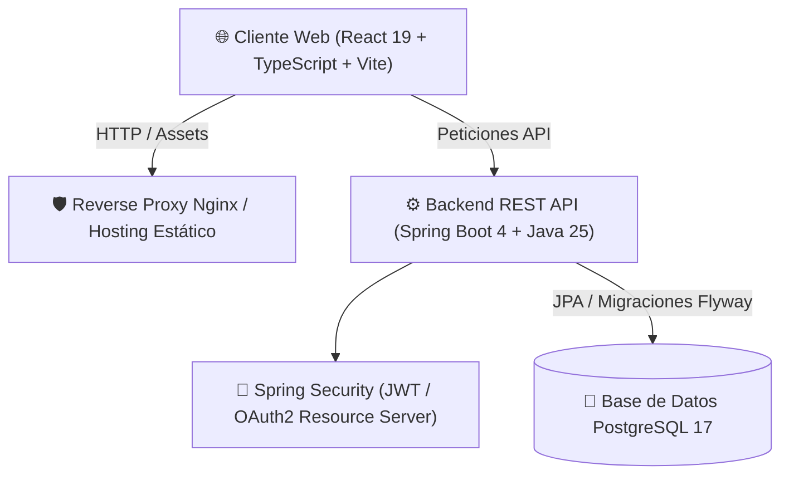

<p align="right">
  <a href="README.md">🇺🇸 English</a> | <strong>🇦🇷 Español</strong>
</p>

<div align="center">

# 🏢 PropDesk

### Plataforma Full-Stack de Gestión Inmobiliaria y Administración de Alquileres


<p align="center">
  Una plataforma web full-stack moderna y responsiva diseñada para propietarios y administradores de propiedades, orientada a optimizar la gestión de contratos, inquilinos, expensas y reportes financieros en tiempo real.
</p>

</div>

---

## 📌 Visión General del Proyecto

**PropDesk** es una solución integral diseñada para resolver las complejidades de la administración de alquileres y propiedades. El sistema ofrece soporte para múltiples roles (propietarios y administradores delegados), proporcionando herramientas intuitivas para el seguimiento de contratos, asignación de gastos y expensas, comunicación con inquilinos y tableros financieros interactivos.

Originado a partir de un proyecto académico universitario, este monorepo consolida tanto el **Backend REST API** como el **Frontend SPA** en una arquitectura desacoplada y lista para producción.

---

## 🏗️ Arquitectura del Sistema

El proyecto sigue una arquitectura limpia y modular:



- **Frontend (`propdesk-web`):** Desarrollado con React 19, TypeScript, Vite, Tailwind CSS y componentes de Radix UI (estilo shadcn/ui). Cuenta con clientes API fuertemente tipados, diseño responsivo y modales interactivos.
- **Backend (`propdesk-api`):** Desarrollado con Java 25 y Spring Boot 4. Arquitectura en capas (Controladores $\rightarrow$ Servicios $\rightarrow$ Repositorios $\rightarrow$ Entidades JPA) con autenticación sin estado mediante JWT, autorización basada en roles, migraciones de base de datos con Flyway y tests unitarios e integrales.
- **Infraestructura:** Docker Compose orquestando PostgreSQL, Spring Boot y Nginx.

---

## 🎯 Funcionalidades Principales y Capturas

### 1. Tablero Financiero y Resumen General
Métricas en tiempo real sobre cobro de alquileres, saldos pendientes, estados de cuenta y rendimiento de la cartera inmobiliaria.

<div align="center">
  
</div>

---

### 2. Gestión de Propiedades y Unidades
Matriz interactiva de unidades y seguimiento del inventario de departamentos distribuidos en distintos edificios.

<div align="center">
  
  <br/><br/>
  
</div>

---

### 3. Administración de Inquilinos y Contratos
Registro centralizado de perfiles de inquilinos, vigencia de contratos, historial de pagos y departamentos asociados.

<div align="center">
  
</div>

---

### 4. Expensas, Mantenimiento y Reportes
Categorización de gastos de mantenimiento, asignación de expensas por unidad y generación de reportes financieros detallados.

<div align="center">
  
  <br/><br/>
  
</div>

---

## 👨‍💻 Contribuciones Destacadas de Noel Escobar

Como parte del equipo de desarrollo, mis aportes clave incluyeron:
- **Arquitectura Frontend y Manejo de Estado:** Diseñé y estructuré la base del cliente web en React con TypeScript y Vite.
- **Implementación de UI/UX:** Desarrollé flujos de usuario centrales e interfaces clave, como el módulo de Autenticación (Login/Registro con correo), modales dinámicos para contratación de administradores, selección de propietarios y formularios interactivos.
- **Módulo de Reportes y Vistas Financieras:** Creé la vista de reportes y componentes de visualización para seguimiento de expensas y balances de rentas.
- **Integración Full-Stack:** Conecté flujos complejos de la interfaz con la API REST, gestionando tokens JWT, guards de navegación y manejo centralizado de errores.
- **Orquestación con Contenedores:** Configuré el entorno multicontenedor con Docker Compose para el despliegue local unificado de todos los servicios.

---

## 🚀 Inicio Rápido (con Docker)

La forma más rápida de ejecutar todo el entorno (Base de Datos + API + Web) es utilizando Docker Compose:

### 1. Clonar el repositorio
```bash
git clone https://github.com/Noel0410/propdesk.git
cd propdesk
```

### 2. Configurar variables de entorno
```bash
cp .env.example .env
```

### 3. Levantar los servicios
```bash
docker compose up -d --build
```

### 4. Acceder a las aplicaciones
- **Interfaz Web (Frontend):** [http://localhost:3000](http://localhost:3000)
- **Backend REST API:** [http://localhost:8080](http://localhost:8080)
- **Documentación Swagger / OpenAPI:** [http://localhost:8080/swagger-ui.html](http://localhost:8080/swagger-ui.html)

---

## 🛠️ Ejecución Local para Desarrollo

Si prefieres correr los servicios de manera individual sin Docker:

### Backend (`propdesk-api`)
**Requisitos:** Java 25, PostgreSQL corriendo localmente.
```bash
cd propdesk-api
cp .env.example .env
./gradlew bootRun
```

### Frontend (`propdesk-web`)
**Requisitos:** Node.js 20+
```bash
cd propdesk-web
cp .env.example .env.local
npm install
npm run dev
```

---

## 📁 Estructura del Repositorio

```text
propdesk/
├── propdesk-api/          # Backend REST API en Spring Boot 4
│   ├── src/               # Código fuente de la aplicación (Java 25)
│   ├── docs/              # Documentación de arquitectura y OpenAPI
│   ├── Dockerfile         # Definición del contenedor backend
│   └── build.gradle.kts   # Configuración de Gradle y dependencias
├── propdesk-web/          # Frontend SPA en React + TypeScript
│   ├── src/               # Componentes y código fuente del frontend
│   ├── public/            # Archivos estáticos de la aplicación
│   ├── Dockerfile         # Construcción multi-stage con Nginx
│   └── package.json       # Scripts y dependencias de Node
├── assets/media/          # Capturas de pantalla y GIFs demostrativos
├── docker-compose.yml     # Orquestación de contenedores (DB + API + Web)
├── .env.example           # Variables de entorno de referencia
├── README.md              # Documentación principal en inglés
└── README.es.md           # Documentación en español
```

---

## 👥 Autores y Agradecimientos

Este proyecto fue desarrollado en colaboración por:
- **Noel Escobar** ([@Noel0410](https://github.com/Noel0410)) - *Arquitectura Frontend, UI/UX e Integración Full-Stack*
- **Camilo Sassone** ([@Vityyy](https://github.com/Vityyy))
- **Valentín Bersi**
- **Damaris Juares**
- **Giuliano Mancinelli**

---

## 📄 Licencia

Este proyecto se encuentra bajo la Licencia MIT - consulta el archivo [LICENSE](propdesk-api/LICENSE) para más detalles.
