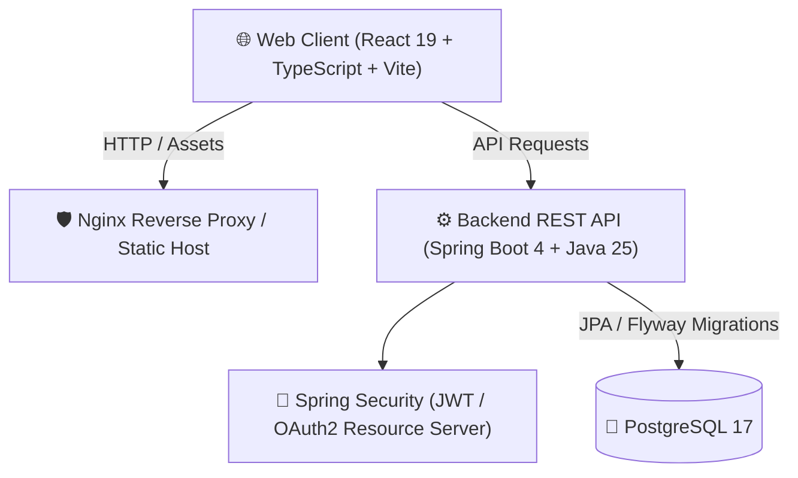
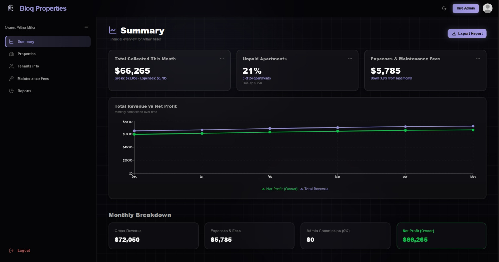
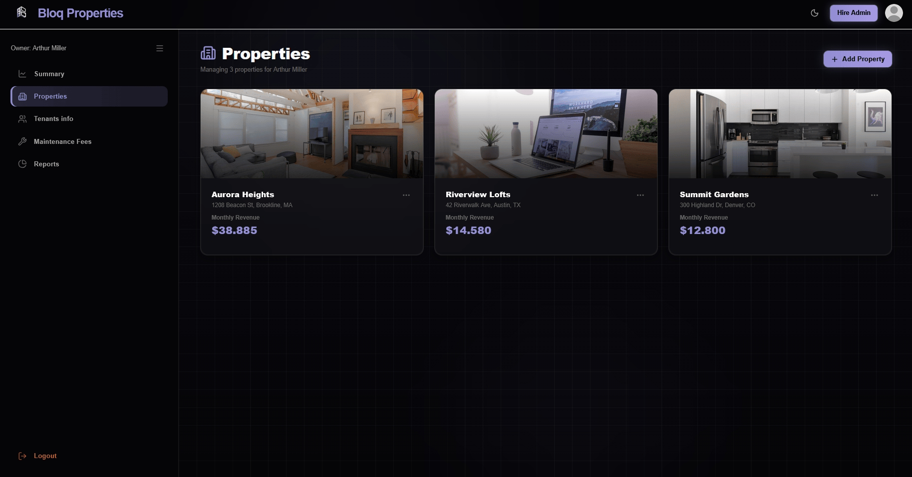
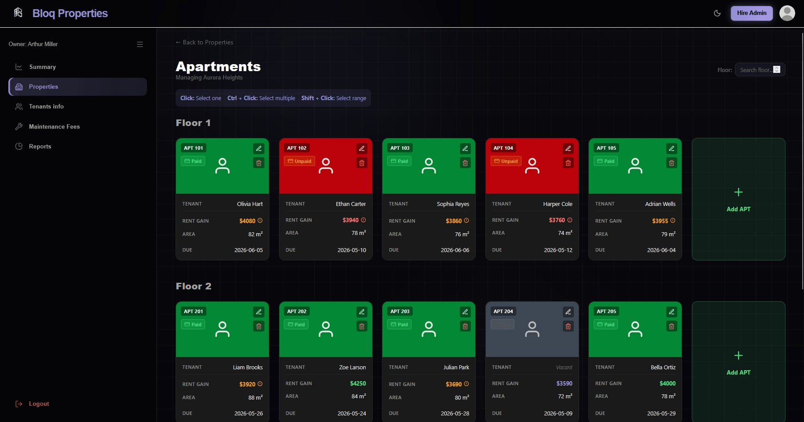
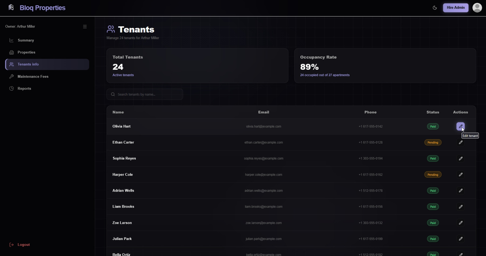
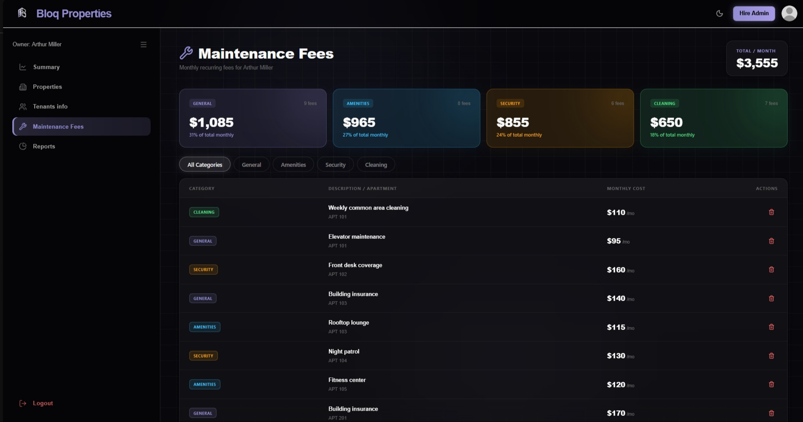
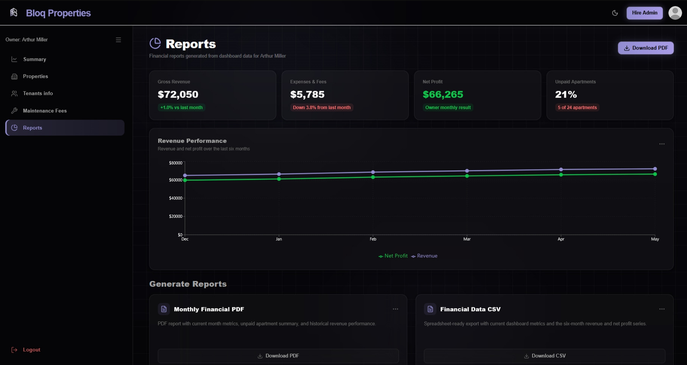

<p align="right">
  <strong>🇺🇸 English</strong> | <a href="README.es.md">🇦🇷 Español</a>
</p>

<div align="center">

# 🏢 PropDesk

### Full-Stack Property & Rental Management Platform


<p align="center">
  A modern, responsive full-stack platform for property owners and rental administrators to streamline real estate operations, tenant lifecycles, maintenance expenses, and financial reporting.
</p>

</div>

---

## 📌 Project Overview

**PropDesk** is an end-to-end management solution designed to solve the complexities of real estate administration. The system supports multi-role operations (property owners and delegated administrators), providing intuitive tools for contract tracking, expense allocation, tenant communications, and real-time financial dashboards.

Originally developed as an intensive academic project, this monorepo consolidates both the **REST API Backend** and the **SPA Frontend** into an integrated, production-ready architecture.

---

## 🏗️ System Architecture

The project follows a decoupled, clean architecture:



- **Frontend (`propdesk-web`):** Built with React 19, TypeScript, Vite, Tailwind CSS, and Radix UI components (shadcn/ui style). Features type-safe API consumers, responsive layouts, and interactive modals.
- **Backend (`propdesk-api`):** Built with Java 25 and Spring Boot 4. Layered architecture (Controllers $\rightarrow$ Services $\rightarrow$ Repositories $\rightarrow$ JPA Entities) with stateless JWT authentication, scoped authorization, Flyway schema migrations, and comprehensive unit/integration tests.
- **Infrastructure:** Docker Compose orchestrating PostgreSQL, Spring Boot, and Nginx.

---

## 🎯 Key Features & UI Showcase

### 1. Financial Summary & Overview
Real-time metrics on rental income, pending balances, collection status, and portfolio performance.

<div align="center">
  
</div>

---

### 2. Property & Apartment Management
Interactive unit matrices and real estate inventory tracking across multiple buildings.

<div align="center">
  
  <br/><br/>
  
</div>

---

### 3. Tenant Administration & Leases
Centralized registry for tenant profiles, contract dates, lease history, and assigned units.

<div align="center">
  
</div>

---

### 4. Maintenance, Expenses & Reports
Expense categorization, fee allocation per apartment, and exportable financial reports.

<div align="center">
  
  <br/><br/>
  
</div>

---

## 👨‍💻 Engineering Highlights & Noel's Contributions

As part of this project, my key contributions included:
- **Frontend Architecture & State Management:** Designed and structured the client-side architecture using React, TypeScript, and Vite.
- **UI/UX Implementation:** Built core user interfaces and workflows, including Authentication (Login/Register with email), dynamic modals for hiring administrators, owner selection flows, and interactive dialogs.
- **Reports & Financial Views:** Engineered the reports module and data visualization components for tracking property expenses and rental income.
- **Full-Stack Integration:** Integrated complex frontend workflows with backend RESTful endpoints, implementing robust error handling and JWT-based authentication guards.
- **Docker Orchestration:** Configured multi-container orchestration with Docker Compose to enable seamless local deployment across all services.

---

## 🚀 Quick Start (Running with Docker)

The easiest way to run the entire stack (PostgreSQL + API + Web) is with Docker Compose:

### 1. Clone the repository
```bash
git clone https://github.com/Noel0410/propdesk.git
cd propdesk
```

### 2. Setup environment variables
```bash
cp .env.example .env
```

### 3. Launch all services
```bash
docker compose up -d --build
```

### 4. Access the applications
- **Frontend Web UI:** [http://localhost:3000](http://localhost:3000)
- **Backend REST API:** [http://localhost:8080](http://localhost:8080)
- **Swagger / OpenAPI Documentation:** [http://localhost:8080/swagger-ui.html](http://localhost:8080/swagger-ui.html)

---

## 🛠️ Local Development Setup

If you prefer to run services individually without Docker:

### Backend (`propdesk-api`)
**Prerequisites:** Java 25, PostgreSQL running locally.
```bash
cd propdesk-api
cp .env.example .env
./gradlew bootRun
```

### Frontend (`propdesk-web`)
**Prerequisites:** Node.js 20+
```bash
cd propdesk-web
cp .env.example .env.local
npm install
npm run dev
```

---

## 📁 Repository Structure

```text
propdesk/
├── propdesk-api/          # Spring Boot 4 Backend REST API
│   ├── src/               # Application source code (Java 25)
│   ├── docs/              # API specifications & architectural records
│   ├── Dockerfile         # Backend container definition
│   └── build.gradle.kts   # Gradle dependencies and configuration
├── propdesk-web/          # React + TypeScript Frontend SPA
│   ├── src/               # Frontend source code & components
│   ├── public/            # Static web assets
│   ├── Dockerfile         # Multi-stage Nginx build definition
│   └── package.json       # Node dependencies and scripts
├── assets/media/          # Screenshots and demo GIFs
├── docker-compose.yml     # Multi-container orchestration (DB + API + Web)
├── .env.example           # Reference environment variables
├── README.md              # Project documentation (English)
└── README.es.md           # Project documentation (Spanish)
```

---

## 👥 Authors & Acknowledgments

This project was built collaboratively by:
- **Noel Escobar** ([@Noel0410](https://github.com/Noel0410))

- **Camilo Sassone** ([@Vityyy](https://github.com/Vityyy))
- **Valentín Bersi** ([@valentinbersi](https://github.com/valentinbersi))
- **Giuseppe Mancinelli** ([@Giuse-04](https://github.com/Giuse-04))

---

## 📄 License

This project is licensed under the MIT License - see the [LICENSE](propdesk-api/LICENSE) file for details.
